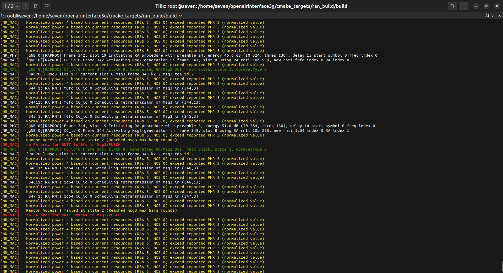
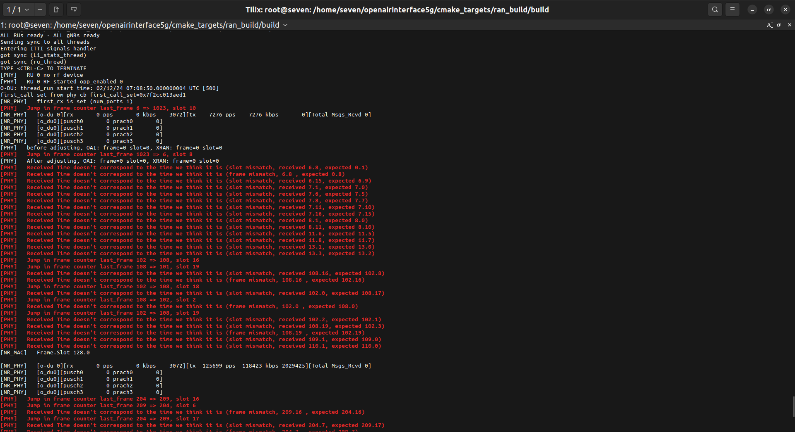
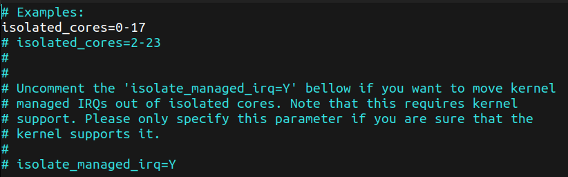
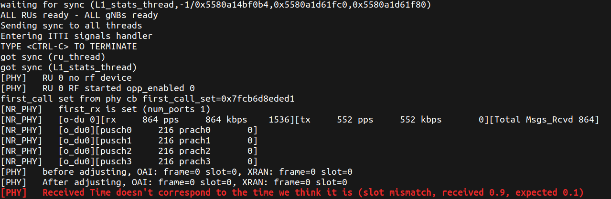
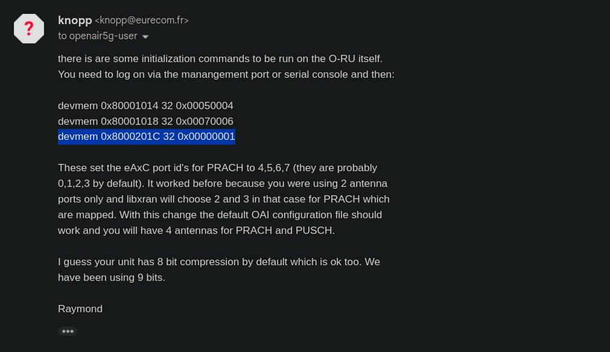

### Error 1:

* This error is generally because of distance between the UE and the Radio. If your UE is kept far away from the Radio then the `./nr-softmodem` cmd will throw these type of logs..

<hr>

### Error 2:

* If you see this error, you have to isolate cpu core in `/etc/tuned/realtime-variables.conf` file and then run this cmd: `tuned-adm profile realtime`
* To isolate cpu cores uncomment the following line and save the file:<br>


<hr>

### Error 3:


* If you are getting prach vales as 0, as shown in above image, follow these steps:
1. Reboot the Radio
2. After the radio is successfully rebooted, if it shows synchronised, run these 3 commands in the radio as root user:
```bash
devmem 0x80001014 32 0x00050004
devmem 0x80001018 32 0x00070006
devmem 0x8000201C 32 0x00000001
```
##### Explaination of above 3 commands:



