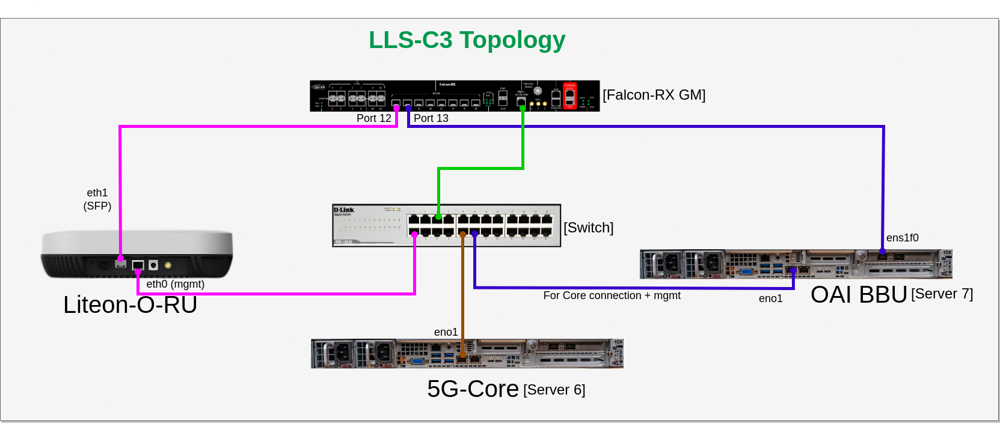

**Table of Contents**
1. [Hardware Info](#1-hardware-info)
   - [2 NUMA Node System](#2-numa-node-system-ie-server-two)
   - [1 NUMA Node System](#1-numa-node-system-ie-server-seven)
2. [Real-Time Kernel](#2-real-time-kernel)
3. [CPU allocation & Grub Update](#3-cpu-allocation--grub-update)
4. [Required Package Installation](#4-required-package-installation)
5. [DPDK(Data Plane Development Kit) 20.11.7](#5-dpdkdata-plane-development-kit-20117)
6. [OSC-PHY installation](#6-osc-phy-installation)
7. [Build OAI gNB](#7-build-oai-gnb)
8. [Linux PTP installation](#8-linux-ptp-installation)
9. [Bind devices](#9-bind-devices)
10. [Configure Server and OAI gNB](#10-configure-server-and-oai-gnb)
11. [Cpu Frequency Adjustment](#11-cpu-frequency-adjustment)
12. [5G Core deployment](#12-5g-core-deployment)
13. [Run OAI gNB](#13-run-oai-gnb)
    - [4T4R](#run-oai-gnb-for-liteon-4t4r)
    - [2T2R](#run-oai-gnb-for-liteon-2t2r)
14. [O-RU commands](#14-o-ru-commands)

  
# 1. Hardware Info
The hardware on which we have tried this tutorial:

### 2 NUMA Node system i.e server `two`

|Hardware (CPU,RAM)                          |Operating System (kernel)                  |NIC (Vendor,Driver)                     | Server Number |
|--------------------------------------------|----------------------------------|-------------------------------------------------|------|
| Intel(R) Xeon(R) Gold 6330, 56-Core, 2 nodes | RHEL 8.7 (with rtk installed) | Intel X710 for 10GbE SFP+,i40e | server 2 |

For further hardware info check out this file: [HW-info-NUMA-2](./hwinfo_2_NUMA.txt)

### 1 NUMA Node system i.e server `seven`

|Hardware (CPU,RAM)                          |Operating System (kernel)                  |NIC (Vendor,Driver,Firmware)                     | Server Number |
|--------------------------------------------|----------------------------------|-------------------------------------------------|------|
| Intel(R) Xeon(R) Gold 6354, 18-Core, 1 nodes | UBUNTU 22.04.2 (with rtk installed) | Intel XXV710 for 10GbE SFP+,i40e,6.80 0x80003d05 1.2007.0 | server 7 |
| Intel(R) Xeon(R) Gold 6354, 18-Core, 1 nodes | UBUNTU 22.04.2 (with rtk installed) | Intel E810 for 10GbE SFP+,ice,4.00 0x8001184e 1.3236.0 | server 7 |

For further hardware info check out this file: [HW-info-NUMA-1](./hwinfo_1_NUMA.txt)

## BIOS settings:

* Turbo boost should be `ON`
* CPU Enhanced Halt State or C1E should be `DISABLED`
* Hyper-Threading should be `OFF`
* SRIOV should be `ENABLED`

# 2. Real-Time Kernel

Install the real time kernel after the fresh OS installation.

```bash
sudo pro attach C12BCiRPRPgoy53ukfYwgxjJbxQg4G
pro enable realtime-kernel
reboot now
```

* After the reboot checkout the kernel version using following commands:
```bash
uname -a
```
It will show something like this:

```bash
seven@seven:~$ uname -a
Linux seven 5.15.0-1053-realtime #59-Ubuntu SMP PREEMPT_RT Fri Jan 12 20:29:00 UTC 2024 x86_64 x86_64 x86_64 GNU/Linux
```

Change the boot order, if rtk does open by default: Use the following command for that:
```bash
sudo grub2-set-default 0
```

Update all the packages now:

```bash
sudo apt update -y
```

# 3. CPU allocation & Grub Update

**This section is important to read, regardless of the operating system you are using.**

Your server could be:

* 1-socket CPU : all the processors are sharing a single memory system.

* 2-socket CPU : processors are grouped in 2 memory systems.

* DPDK, OAI and kernel threads require to be properly allocated to extract maximum real-time performance for your use case.


* Currently the default OAI 7.2 configuration file requires isolated CPUs 0,2,4 for DPDK/libXRAN, 

* CPU 6 for ru_thread and CPU 8 for L1_rx_thread. 

> It is preferrable to have all these threads on the same socket.

* Allocating CPUs to the nr-softmodem is done using the --thread-pool option. 

* Allocating 4 CPUs is the minimal configuration but we recommend to allocate at least 8 CPUs. And they can be on a different socket as the DPDK threads.
And to avoid kernel preempting these allocated CPUs, it is better to force the kernel to use un-allocated CPUs.

Let summarize for example on a 32-CPU system, regardless of the number of sockets:

### For one socket system i.e 1 NUMA Node
|Applicative Threads  | Allocated CPUs   |
|---------------------|------------------|
| XRAN DPDK usage     | 0,2,4            |
| OAI ru_thread       | 6                |
| OAI L1_rx_thread    | 8                |
| nr-softmodem        | 9,10,11,12,13,14,15    |
| kernel              | 16-17           |

> Note: In our case we have `18` cores
```
NUMA node0 CPU(s):   0-17
```
Copy the below arguements and paste it in the `/etc/default/grub` file.

```bash
igb.max_vfs=2 intel_iommu=on iommu=pt mitigations=off cgroup_memory=1 cgroup_enable=memory mce=off idle=poll hugepagesz=1G hugepages=40 hugepagesz=2M hugepages=0 default_hugepagesz=1G selinux=0 enforcing=0 nmi_watchdog=0 softlockup_panic=0 audit=0 skew_tick=1 rcu_nocb_poll cgroup_disable=memory kthread_cpus=16-17 skew_tick=1 isolcpus=managed_irq,domain,0-8 nohz_full=0-8 rcu_nocbs=0-8 intel_pstate=disable nosoftlockup tsc=nowatchdog
```
> **OR**

### For two socket system i.e 2 NUMA Node
|Applicative Threads  | Allocated CPUs   |
|---------------------|------------------|
| XRAN DPDK usage     | 0,2,4            |
| OAI ru_thread       | 6                |
| OAI L1_rx_thread    | 8                |
| nr-softmodem        | 30,31,32,33,34,35,36,36,37 |
| kernel              | 9-27,38-55       |

> Note: In our case we have `56` cores
```
NUMA node0 CPU(s):   0-27
NUMA node1 CPU(s):   28-55
```
Copy the below arguements and paste it in the `/etc/default/grub` file.

```bash
igb.max_vfs=2 intel_iommu=on iommu=pt mitigations=off cgroup_memory=1 cgroup_enable=memory mce=off idle=poll hugepagesz=1G hugepages=40 hugepagesz=2M hugepages=0 default_hugepagesz=1G selinux=0 enforcing=0 nmi_watchdog=0 softlockup_panic=0 audit=0 skew_tick=1 rcu_nocb_poll cgroup_disable=memory kthread_cpus=9-27,38-55 skew_tick=1 isolcpus=managed_irq,domain,0-8 nohz_full=0-8 rcu_nocbs=0-8 intel_pstate=disable nosoftlockup tsc=nowatchdog
```


```bash
sudo vim /etc/default/grub
```
and paste it under `GRUB_CMDLINE_LINUX` part.

It will look something like this:

```bash
seven@seven:~$ cat /etc/default/grub
# If you change this file, run 'update-grub' afterwards to update
# /boot/grub/grub.cfg.
# For full documentation of the options in this file, see:
#   info -f grub -n 'Simple configuration'

GRUB_DEFAULT=0
GRUB_TIMEOUT_STYLE=hidden
GRUB_TIMEOUT=0
GRUB_DISTRIBUTOR=`lsb_release -i -s 2> /dev/null || echo Debian`
GRUB_CMDLINE_LINUX_DEFAULT=""
GRUB_CMDLINE_LINUX="igb.max_vfs=2 intel_iommu=on iommu=pt mitigations=off cgroup_memory=1 cgroup_enable=memory mce=off idle=poll hugepagesz=1G hugepages=40 hugepagesz=2M hugepages=0 default_hugepagesz=1G selinux=0 enforcing=0 nmi_watchdog=0 softlockup_panic=0 audit=0 skew_tick=1 rcu_nocb_poll cgroup_disable=memory kthread_cpus=16-17 skew_tick=1 isolcpus=managed_irq,domain,0-8 nohz_full=0-8 rcu_nocbs=0-8 intel_pstate=disable nosoftlockup tsc=nowatchdog"

# Uncomment to enable BadRAM filtering, modify to suit your needs
# This works with Linux (no patch required) and with any kernel that obtains
# the memory map information from GRUB (GNU Mach, kernel of FreeBSD ...)
#GRUB_BADRAM="0x01234567,0xfefefefe,0x89abcdef,0xefefefef"

# Uncomment to disable graphical terminal (grub-pc only)
#GRUB_TERMINAL=console

# The resolution used on graphical terminal
# note that you can use only modes which your graphic card supports via VBE
# you can see them in real GRUB with the command `vbeinfo'
#GRUB_GFXMODE=640x480

# Uncomment if you don't want GRUB to pass "root=UUID=xxx" parameter to Linux
#GRUB_DISABLE_LINUX_UUID=true

# Uncomment to disable generation of recovery mode menu entries
#GRUB_DISABLE_RECOVERY="true"

# Uncomment to get a beep at grub start
#GRUB_INIT_TUNE="480 440 1"
```
> NOTE: In grub, make sure to give specific cores to `kthread_cpus` in `GRUB_CMDLINE_LINUX` based on the system.

grub update

```bash
sudo grub2-mkconfig -o /boot/grub2/grub.cfg
```

Change the kernel order to rtk before rebooting:

```bash
sudo grub2-set-default 0
```
Reboot
```bash
sudo reboot
```

After rebooting turn on th real time profile:

```bash
apt install tuned

vim /etc/tuned/realtime-variables.conf 

# uncomment isolated cores
isolated_cores=0-17
#save and exit 


tuned-adm profile realtime
```

Now check whether 40 hugepages are created or not:

```bash
grep HugePages /proc/meminfo
```

# 4. Required Package Installation

```bash
sudo apt install wget xz-utils
sudo apt install meson
apt install pkg-config
sudo apt install linux-tools-$(uname -r)
```


# 5. DPDK(Data Plane Development Kit) 20.11.7

```bash
wget http://fast.dpdk.org/rel/dpdk-20.11.7.tar.xz
tar xvf dpdk-20.11.7.tar.xz && cd dpdk-stable-20.11.7
meson build
ninja -C build
sudo ninja install -C build
```
> Note: DPDK build process will take a good time to complete.

* After DPDK has been built successfully, execute the following commands.

```bash
sudo echo "/usr/local/lib" > /etc/ld.so.conf.d/local-lib.conf
sudo echo "/usr/local/lib64" >> /etc/ld.so.conf.d/local-lib.conf
sudo ldconfig -v | grep rte_
```
* Export the following path

```bash
export PKG_CONFIG_PATH=$PKG_CONFIG_PATH:/usr/local/lib64/pkgconfig/
pkg-config --libs libdpdk --static
```

the above command should give the following output:

```bash
seven@seven:~$ pkg-config --libs libdpdk --static

-L/usr/local/lib/x86_64-linux-gnu -Wl,--whole-archive -l:librte_common_cpt.a -l:librte_common_dpaax.a -l:librte_common_iavf.a -l:librte_common_octeontx.a -l:librte_common_octeontx2.a -l:librte_common_sfc_efx.a -l:librte_bus_dpaa.a -l:librte_bus_fslmc.a -l:librte_bus_ifpga.a -l:librte_bus_pci.a -l:librte_bus_vdev.a -l:librte_bus_vmbus.a -l:librte_common_qat.a -l:librte_mempool_bucket.a -l:librte_mempool_dpaa.a -l:librte_mempool_dpaa2.a -l:librte_mempool_octeontx.a -l:librte_mempool_octeontx2.a -l:librte_mempool_ring.a -l:librte_mempool_stack.a -l:librte_net_af_packet.a -l:librte_net_ark.a -l:librte_net_atlantic.a -l:librte_net_avp.a -l:librte_net_axgbe.a -l:librte_net_bond.a -l:librte_net_bnxt.a -l:librte_net_cxgbe.a -l:librte_net_dpaa.a -l:librte_net_dpaa2.a -l:librte_net_e1000.a -l:librte_net_ena.a -l:librte_net_enetc.a -l:librte_net_enic.a -l:librte_net_failsafe.a -l:librte_net_fm10k.a -l:librte_net_i40e.a -l:librte_net_hinic.a -l:librte_net_hns3.a -l:librte_net_iavf.a -l:librte_net_ice.a -l:librte_net_igc.a -l:librte_net_ixgbe.a -l:librte_net_kni.a -l:librte_net_liquidio.a -l:librte_net_memif.a -l:librte_net_netvsc.a -l:librte_net_nfp.a -l:librte_net_null.a -l:librte_net_octeontx.a -l:librte_net_octeontx2.a -l:librte_net_pfe.a -l:librte_net_qede.a -l:librte_net_ring.a -l:librte_net_sfc.a -l:librte_net_softnic.a -l:librte_net_tap.a -l:librte_net_thunderx.a -l:librte_net_txgbe.a -l:librte_net_vdev_netvsc.a -l:librte_net_vhost.a -l:librte_net_virtio.a -l:librte_net_vmxnet3.a -l:librte_raw_dpaa2_cmdif.a -l:librte_raw_dpaa2_qdma.a -l:librte_raw_ioat.a -l:librte_raw_ntb.a -l:librte_raw_octeontx2_dma.a -l:librte_raw_octeontx2_ep.a -l:librte_raw_skeleton.a -l:librte_crypto_bcmfs.a -l:librte_crypto_caam_jr.a -l:librte_crypto_dpaa_sec.a -l:librte_crypto_dpaa2_sec.a -l:librte_crypto_nitrox.a -l:librte_crypto_null.a -l:librte_crypto_octeontx.a -l:librte_crypto_octeontx2.a -l:librte_crypto_scheduler.a -l:librte_crypto_virtio.a -l:librte_compress_octeontx.a -l:librte_regex_octeontx2.a -l:librte_vdpa_ifc.a -l:librte_event_dlb.a -l:librte_event_dlb2.a -l:librte_event_dpaa.a -l:librte_event_dpaa2.a -l:librte_event_octeontx2.a -l:librte_event_opdl.a -l:librte_event_skeleton.a -l:librte_event_sw.a -l:librte_event_dsw.a -l:librte_event_octeontx.a -l:librte_baseband_null.a -l:librte_baseband_turbo_sw.a -l:librte_baseband_fpga_lte_fec.a -l:librte_baseband_fpga_5gnr_fec.a -l:librte_baseband_acc100.a -l:librte_node.a -l:librte_graph.a -l:librte_bpf.a -l:librte_flow_classify.a -l:librte_pipeline.a -l:librte_table.a -l:librte_port.a -l:librte_fib.a -l:librte_ipsec.a -l:librte_vhost.a -l:librte_stack.a -l:librte_security.a -l:librte_sched.a -l:librte_reorder.a -l:librte_rib.a -l:librte_regexdev.a -l:librte_rawdev.a -l:librte_pdump.a -l:librte_power.a -l:librte_member.a -l:librte_lpm.a -l:librte_latencystats.a -l:librte_kni.a -l:librte_jobstats.a -l:librte_ip_frag.a -l:librte_gso.a -l:librte_gro.a -l:librte_eventdev.a -l:librte_efd.a -l:librte_distributor.a -l:librte_cryptodev.a -l:librte_compressdev.a -l:librte_cfgfile.a -l:librte_bitratestats.a -l:librte_bbdev.a -l:librte_acl.a -l:librte_timer.a -l:librte_hash.a -l:librte_metrics.a -l:librte_cmdline.a -l:librte_pci.a -l:librte_ethdev.a -l:librte_meter.a -l:librte_net.a -l:librte_mbuf.a -l:librte_mempool.a -l:librte_rcu.a -l:librte_ring.a -l:librte_eal.a -l:librte_telemetry.a -l:librte_kvargs.a -Wl,--no-whole-archive -Wl,--export-dynamic -Wl,--as-needed -lrte_node -lrte_graph -lrte_bpf -lrte_flow_classify -lrte_pipeline -lrte_table -lrte_port -lrte_fib -lrte_ipsec -lrte_vhost -lrte_stack -lrte_security -lrte_sched -lrte_reorder -lrte_rib -lrte_regexdev -lrte_rawdev -lrte_pdump -lrte_power -lrte_member -lrte_lpm -lrte_latencystats -lrte_kni -lrte_jobstats -lrte_ip_frag -lrte_gso -lrte_gro -lrte_eventdev -lrte_efd -lrte_distributor -lrte_cryptodev -lrte_compressdev -lrte_cfgfile -lrte_bitratestats -lrte_bbdev -lrte_acl -lrte_timer -lrte_hash -lrte_metrics -lrte_cmdline -lrte_pci -lrte_ethdev -lrte_meter -lrte_net -lrte_mbuf -lrte_mempool -lrte_rcu -lrte_ring -lrte_eal -lrte_telemetry -lrte_kvargs -pthread -lm -ldl
```


# 6. OSC-PHY installation

```bash
git clone -b fhi_4t_4r https://github.com/NgKore47/Liteon-ngKore_E.git
cd Liteon-ngKore_E/
cd phy/
git apply ../openairinterface5g/cmake_targets/tools/oran_fhi_integration_patches/E/oaioran_E.patch
cd fhi_lib/lib/

#set env variables
export RTE_SDK=/home/seven/dpdk-stable-20.11.7/ 
export XRAN_DIR=/home/seven/phy/fhi_lib

make clean
make XRAN_LIB_SO=1
```
> **Note:** In this liteon-phy repo, the patch file(phy_final.patch) is already applied. You need not to apply it again.

#### In case of any error related to SDK, export the following path and try to run `make XRAN_LIB_SO=1` again :
```bash
export XRAN_LIB_DIR=/home/$(hostname)/phy/fhi_lib/lib/build
export XRAN_DIR=/home/$(hostname)/phy/fhi_lib
export RTE_SDK=/home/$(hostname)/dpdk-stable-20.11.7
export RTE_TARGET=x86_64-native-linuxapp-gcc
export RTE_INCLUDE=/usr/local/include
```

#### Output will show something like this:
```
[AR] build/libxran.so
./build/libxran.so
GTEST_ROOT is not set. Unit tests are not compiled
"echo "GTEST_ROOT is not set. Unit tests are not compiled"" command exited with code 0.
```

# 7. Build OAI gNB

### Build OAI
```bash
cd Liteon-ngKore_E/cmake_targets/
sudo apt install -y libnuma-dev
export PKG_CONFIG_PATH=/opt/dpdk/lib64/pkgconfig/

./build_oai -I  # if you never installed OAI, use this command once before the next line
./build_oai --gNB --ninja -t oran_fhlib_5g --cmake-opt -Dxran_LOCATION=$HOME/Liteon-ngKore_E/phy/fhi_lib/lib

#You can optionally check that everything has been linked properly with:
ldd ran_build/build/liboran_fhlib_5g.so
```


### Copy the `libxran.xo`
```bash
sudo cp /home/$(hostname)/phy/fhi_lib/lib/build/libxran.so /usr/local/lib
sudo cp /home/$(hostname)/phy/fhi_lib/lib/build/libxran.so /home/$(hostname)/Liteon-ngKore_E/cmake_targets/ran_build/build
```

# 8. Linux PTP installation

For this tutorial we are using `Fibrolan Falcon-Rx` C1 & C3 both can be used.<br>
While using C1: `ens1f1` is connected with Fibrolan and `ens1f0` is directly connected with Liteon O-RU.<br>
While using C3 `ens1f0` is connected with Fibrolan. <br>
Here `ens1f0` is the interface of DU server.

> **NOTE:** <br> 
> Generally, in `C1`,  *RU --- DU --- PTP*  i.e `RU` is directly connected to `DU` and `DU` is connected to clock source(`Fibrolan`).<br>
> But in `C3`,   *RU --- PTP --- DU*  i.e `RU` is directly connected to clock source(`Fibrolan`) and then clock source is connected to `DU`.

```bash
git clone https://github.com/NgKore47/linuxptp.git
```
### Build linuxptp:
```bash
cd linuxptp
sudo make 
sudo make install
```

### Run `ptp4l` & `phc2sys` using linuxptp
#### For C1

```bash
sudo ./ptp4l -i ens1f1 -m -H -2 -s -f configs/c1.cfg
sudo ./phc2sys -w -m -s ens1f1 -R 8 -f configs/c1.cfg
sudo ./ptp4l -i ens1f0 -m -H -2 -f configs/c1.cfg
```
#### For C3

```bash
sudo ./ptp4l -i ens1f0 -m -H -2 -s -f configs/c1.cfg
sudo ./phc2sys -w -m -s ens1f0 -R 8 -f configs/c1.cfg
```
> **Note:** Use specific interface name in place of `ens1f0`, based on your system.
> In Case of NIC E810, set `x_timestamp_timeout`  to  `100` in `configs/c1.cfg` file.


# 9. Bind devices
**Note:** Same interface `ens1f0` will be used here.

> **NOTE:**  You must be super-user

```bash
echo "0" > /sys/class/net/ens1f0/device/sriov_numvfs
echo "2" > /sys/class/net/ens1f0/device/sriov_numvfs
sudo ip link set ens1f0 vf 0 mac 00:11:22:33:44:66 vlan 564 spoofchk off trust on 
sudo ip link set ens1f0 vf 1 mac 00:11:22:33:44:66 vlan 564 spoofchk off trust on
modprobe vfio_pci
```

> **NOTE:** Check the PCI address of the virtual functions and change it accordingly, in this case it is: `0000:31:02.0` & `0000:31:02.1`<br>
> In case of `NIC E810`, make sure to use different MAC address for both vfs like:<br>
> for vf 0 --> `00:11:22:33:44:66` and for vf 1 --> `00:11:22:33:44:77`

```bash
sudo /usr/local/bin/dpdk-devbind.py -s
sudo /usr/local/bin/dpdk-devbind.py --bind vfio-pci 0000:31:02.0
sudo /usr/local/bin/dpdk-devbind.py --bind vfio-pci 0000:31:02.1
sudo ifconfig ens1f0 mtu 1500
sudo ethtool -G ens1f0 rx 4096 tx 4096
```
> **NOTE:** Use `ethtoog -g <interface_name>` to see max rx and tx

# 10. Configure Server and OAI gNB

### Check the following this in the `mwc_20899_newfhi_E_3450.conf` file
* The `PLMN` section shall match the one defined in the AMF

* `amf_ip_address` shall be the correct AMF IP address in your system i.e. `192.168.70.132` for OAI-Core

* `GNB_INTERFACE_NAME_FOR_NG_AMF` and `GNB_IPV4_ADDRESS_FOR_NG_AMF` shall match your DU N2 interface name and IP address

* `GNB_INTERFACE_NAME_FOR_NGU` and `GNB_IPV4_ADDRESS_FOR_NGU` shall match your DU N3 interface name and IP address

* Adjust the `frequency`, `bandwidth` and `SSB` position

* Set an isolated core for L1 thread `L1_rx_thread_core` in our environment we are using CPU 8

* Set an isolated core for RU thread `ru_thread_core` in our environment we are using CPU 6

* `phase_compensation` should be set to 0 to disable when it is performed in the RU and set to 1 when it should be performed on the DU side

* Here change the `du_addr` , `ru_addr` , `iq_width` and `iq_width_prach` as compression bit , `dpdk_devices` as pci address of vfs according to your server:
```bash
fhi_72 = {
dpdk_devices = ("0000:18:01.0", "0000:18:01.1");
  io_core = 4;
  worker_cores = (2);
  du_addr = ("00:11:22:33:44:99", "00:11:22:33:44:77");
  ru_addr = ("e8:c7:4f:1e:c7:4d", "e8:c7:4f:1e:c7:4d");   #new RU
  #ru_addr = ("e8:c7:4f:1e:c7:3b", "e8:c7:4f:1e:c7:3b");   #old RU
  mtu = 1500; # check if xran uses this properly
  fh_config = ({
    Tadv_cp_dl = 125;
    T2a_cp_dl = (285, 429); # (min, max)
    T2a_cp_ul = (285, 429); # (min, max)
    T2a_up = (125, 428); # (min, max)
    Ta3 = (130, 170); # (min, max)
    T1a_cp_dl = (285, 429); # (min, max)
    T1a_cp_ul = (285, 429); # (min, max)
    T1a_up = (96, 196); # (min, max)
    Ta4 = (110, 180); # (min, max)
    ru_config = {
      iq_width = 9;
      iq_width_prach = 9;
      fft_size = 12;
    };
    prach_config = {
      eAxC_offset = 4;
      kbar = 0;
    };
``` 
> **NOTE:** Here is more detailed `git_diff.patch` file: [click here](./logs/git_diff.patch)

# 11. Cpu Frequency Adjustment:

* Set the cpu on maximum frequency:

```bash
sudo cpupower frequency-set -g performance
sudo cpupower idle-set -D 0
```

* In this server 3.1 GHz is the max freq that cpu supports

```bash
sudo cpupower frequency-set -u 3100000
sudo cpupower frequency-set -d 3100000
```

> **NOTE:** After doing the whole tests, set the frequency to default values by running the following commands.

```bash
sudo cpupower frequency-set --governor powersave
sudo cpupower frequency-set --min 800MHz --max 3.10GHz
sudo cpupower idle-set -E
```

> **NOTE:** This system supports minimum 800 MHz frequency <br>
> You can also see the current frequency using: `cpupower frequency-info `<br>
> Also to see temprature of system use: `sensors`

# 12. 5G Core deployment

For 5G core deployment refer this repo:
[Ngkore-CN5G](https://github.com/NgKore47/Ngkore-CN5G.git)

In other server 5G core should be running

For giving path to the 5G core Server, execute the following command:

```bash
sudo ip route add 192.168.70.128/26 via 192.168.1.185 dev enp177s0f0 
```
where  `enp177s0f0` is the interface of this system which will be connected to the 5G Core and `192.168.1.185` is the ip of the server on which 5G Core is running.

# 13. Run OAI gNB

## Run OAI gNB for LiteOn 4T4R

```bash
cd ~/Liteon-ngKore_E/cmake_targets/ran_build/build/
# For 1 NUMA Node system
sudo ./nr-softmodem -O ../../../targets/PROJECTS/GENERIC-NR-5GC/CONF/gnb.sa.band78.273prb.fhi72.4x4-liteon.conf --sa --reorder-thread-disable 1 --thread-pool 10,11,12,13,14,15,16,17

# For 2 NUMA Node system
sudo ./nr-softmodem -O ../../../targets/PROJECTS/GENERIC-NR-5GC/CONF/gnb.sa.band78.273prb.fhi72.4x4-liteon.conf --sa --reorder-thread-disable 1 --thread-pool 30,31,32,33,34,35,36,36,37
```

> **NOTE:** Make sure to change the cores according to your server specs.

The logs should be something like this for 4T4R: [nr-softmodem](./logs/ubuntu%2022%20liteon%204t4r%20develop%20-->%20logs%20when%20UE%20is%20near(UE%20disconnect%20after%201%20min))


## Run OAI gNB for LiteOn 2T2R

```bash
cd ~/Liteon-ngKore_E/cmake_targets/ran_build/build/
# For 1 NUMA Node system
sudo ./nr-softmodem -O ../../../targets/PROJECTS/GENERIC-NR-5GC/CONF/gnb.sa.band78.273prb.fhi72.2x2-liteon.conf --sa --reorder-thread-disable 1 --thread-pool 10,11,12,13,14,15,16,17

# For 2 NUMA Node system
sudo ./nr-softmodem -O ../../../targets/PROJECTS/GENERIC-NR-5GC/CONF/gnb.sa.band78.273prb.fhi72.2x2-liteon.conf --sa --reorder-thread-disable 1 --thread-pool 30,31,32,33,34,35,36,36,37
```

> **NOTE:** Make sure to change the cores according to your server specs.

The logs should be something like this for 2T2R: [nr-softmodem](./logs/ubuntu%2022%20liteon%202t2r%20develop)

#### Difference betweem 4t4r and 2t2r conf file:
- Here is the difference between the 4t4r and 2t2r radio file: https://www.diffchecker.com/rWA7tV4R/


# 14. O-RU commands

After every reboot of RU, run the following commands:

> **NOTE:** Prefer not to copy and paste these commands

```bash
devmem 0x80001014 32 0x00050004
devmem 0x80001018 32 0x00070006
devmem 0x8000201C 32 0x00000001
```


<hr>

### Official Readme
Here is the official readme by OAI: [here](./Official_README.md)